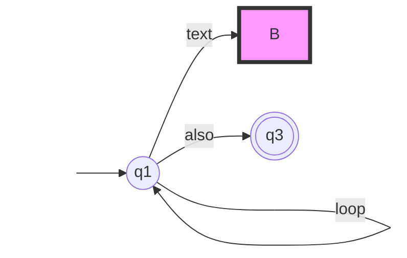

Q12
==
(A)

(a)

&sum; = { a, b, c} for  transform, potion, spell

(b)

L1 = { a2n bn cm | m>1, n>0 }

L2 = { a2n cm bn | m>1, n>0 }

L = L1 &cup; L2  

(c)

[Must build Push-down Automaton]

(B)

(1)  L1 &cap; L2 = &empty;

(2)  (L3 R(L3)) &cap; L1 = L1

(3)   L&#x305;2 = { w |  |w| mod 2 = 0 }

(4)  L4 &cap; L&#x305;2 = L4

(5)  (L4 R(L4) ) &cap; L5 = { an b am | (n+m) mod 2 = 1 }
